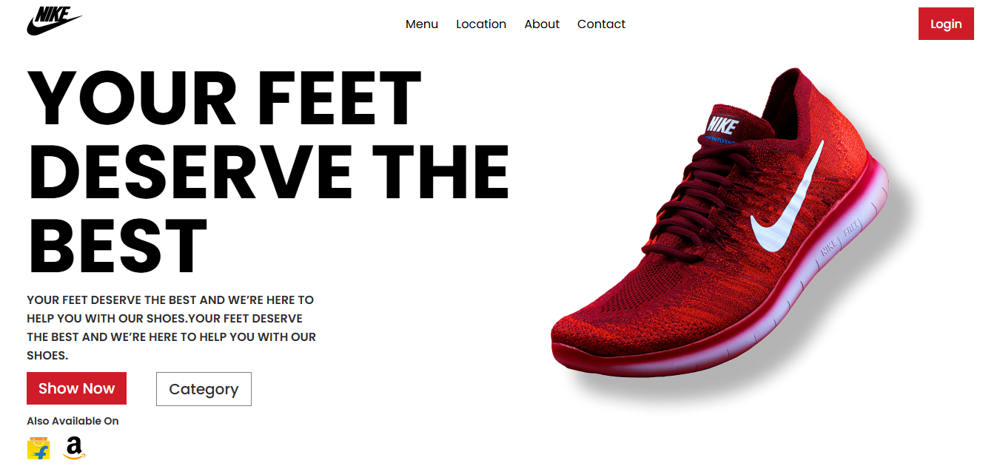

# Shoe Store Landing Page

A responsive React landing page for a shoe store, built with [Vite](https://vitejs.dev/) and [React](https://react.dev/).

## Features

- Responsive navigation menu
- Home section with promotional content
- Shopping links for Flipkart and Amazon
- Styled with CSS and Google Fonts

## Getting Started

### Prerequisites

- [Node.js](https://nodejs.org/) (v18 or higher recommended)
- [npm](https://www.npmjs.com/) (comes with Node.js)

### Installation

Clone the repository and install dependencies:

```sh
git clone https://github.com/your-username/project-1.git
cd project-1
npm install
```

### Running Locally

Start the development server:

```sh
npm run dev
```

Open [http://localhost:5173](http://localhost:5173) in your browser.

### Building for Production

```sh
npm run build
```

### Preview Production Build

```sh
npm run preview
```

## Project Structure

```
src/
  App.jsx
  App.css
  main.jsx
  index.css
  components/
    Home.jsx
    Navigation.jsx
  assets/
    react.svg
public/
  images/
    amazon.png
    brand_logo.png
    flipkart.png
    shoe_image.png
```

## Screenshots



## License

This project is for learning purposes
